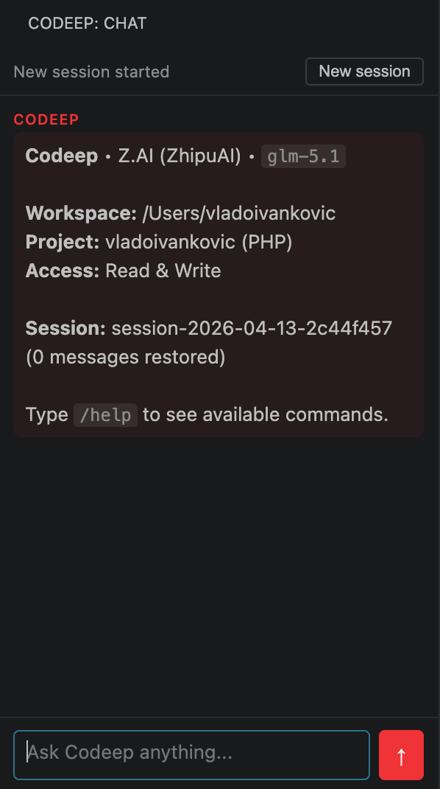

# Codeep for VS Code

AI coding assistant sidebar for VS Code — powered by the [Codeep CLI](https://github.com/VladoIvankovic/Codeep).



## Requirements

Install the Codeep CLI first:

```bash
npm install -g codeep
```

## Features

- **Chat sidebar** — ask questions, get explanations, request changes, all within VS Code
- **Streaming responses** — see the AI reply as it's being generated
- **Send selection** — highlight code and send it directly to chat (`Cmd+Shift+X`)
- **Review file** — right-click any file to run an AI code review
- **New session** — start a fresh conversation at any time

## Usage

Open the Codeep panel from the activity bar (red bracket icon), or press `Cmd+Shift+C`.

The extension connects to the Codeep CLI automatically on startup. Once connected, type your message and press `Enter` to send (`Shift+Enter` for a new line).

### Commands

| Command | Shortcut | Description |
|---|---|---|
| Codeep: Open Chat | `Cmd+Shift+C` | Open the chat sidebar |
| Codeep: Send Selection to Chat | `Cmd+Shift+X` | Send selected code to chat |
| Codeep: Review Current File | — | AI review of the active file |
| Codeep: New Session | — | Start a new conversation |

### In-chat commands

You can use any Codeep CLI commands directly in the chat:

```
/review          AI-powered git diff review
/review --staged Review only staged changes
/cost            Show token usage and cost
/model           Switch AI model
/help            List all available commands
```

## Configuration

| Setting | Default | Description |
|---|---|---|
| `codeep.cliPath` | `codeep` | Path to the Codeep CLI executable |
| `codeep.provider` | _(CLI default)_ | Override AI provider |
| `codeep.model` | _(CLI default)_ | Override AI model |

If `codeep` is not on your PATH, set the full path in settings:

```json
{
  "codeep.cliPath": "/usr/local/bin/codeep"
}
```

## How it works

The extension communicates with the Codeep CLI via the **Agent Client Protocol (ACP)** — a JSON-RPC protocol over stdio. Each VS Code workspace gets its own CLI session, so the agent has full context of your project.

## License

MIT
