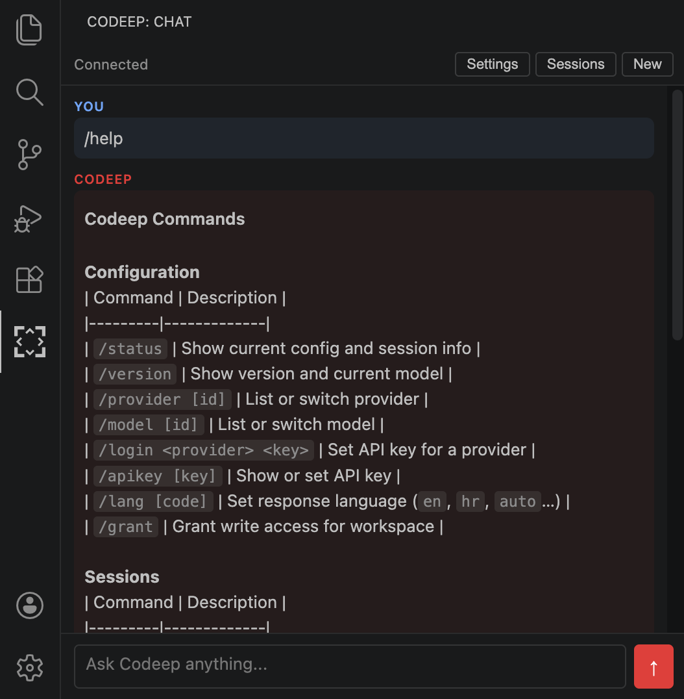
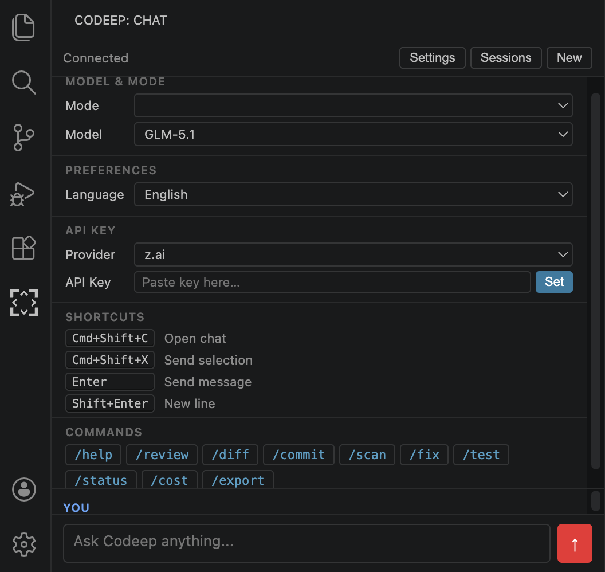

# Codeep for VS Code

AI coding assistant sidebar for VS Code — powered by the [Codeep CLI](https://github.com/VladoIvankovic/Codeep).

[](https://marketplace.visualstudio.com/items?itemName=VladoIvankovic.codeep)





## Requirements

Install the Codeep CLI first:

```bash
npm install -g codeep
```

## Features

- **Chat sidebar** — ask questions, get explanations, request changes, all within VS Code
- **Streaming responses** — see the AI reply as it's being generated
- **Live agent plan** — when the agent works on a multi-step task, watch its plan update in real time (○ pending, ◐ in progress, ● done)
- **Reasoning stream** — collapsible "Thinking" card shows the model's reasoning before the answer (when the model exposes it)
- **Send selection** — highlight code and send it directly to chat (`Cmd+Shift+X`)
- **Review file** — right-click any file to run an AI code review
- **Session browser** — list, load, and delete past conversations
- **Settings panel** — switch AI model, provider, and permission mode without leaving the editor
- **Inline permission prompts with diff preview** — see exactly what the agent wants to write, edit, or run before approving (no surprises)
- **New session** — start a fresh conversation at any time

## Usage

Open the Codeep panel from the activity bar (red bracket icon), or press `Cmd+Shift+C`.

The extension connects to the Codeep CLI automatically on startup. Once connected, type your message and press `Enter` to send (`Shift+Enter` for a new line).

### Commands

| Command | Shortcut | Description |
|---|---|---|
| Codeep: Open Chat | `Cmd+Shift+C` | Open the chat sidebar |
| Codeep: Send Selection to Chat | `Cmd+Shift+X` | Send selected code to chat |
| Codeep: Review Current File | — | AI review of the active file |
| Codeep: New Session | — | Start a new conversation |

### Sessions

Click **Sessions** in the toolbar to browse past conversations. Click a session to load it (history is restored in the chat). Use the × button to delete a session.

### Settings

Click **Settings** in the toolbar to change the AI model, provider, and permission mode. Changes take effect immediately.

### Permission prompts

When the agent wants to write a file or run a shell command, an inline card appears in the chat asking you to **Allow once**, **Allow always**, or **Deny**. No popups.

The card now shows a **preview** of what would happen:

- **Edit file** → side-by-side `-` / `+` diff of the change
- **Write file** → full content preview (first 200 lines for large files)
- **Run command** → the exact `$ command` and `cwd` that would execute

Truncated payloads are marked so you know you're not seeing the full thing.

## Configuration

| Setting | Default | Description |
|---|---|---|
| `codeep.cliPath` | `codeep` | Path to the Codeep CLI executable |
| `codeep.provider` | _(CLI default)_ | Override AI provider |
| `codeep.model` | _(CLI default)_ | Override AI model |

If `codeep` is not on your PATH, set the full path in settings:

```json
{
  "codeep.cliPath": "/usr/local/bin/codeep"
}
```

## How it works

The extension communicates with the Codeep CLI via the **Agent Client Protocol (ACP)** — a JSON-RPC protocol over stdio. Each VS Code workspace gets its own CLI session, so the agent has full context of your project.

## License

MIT
